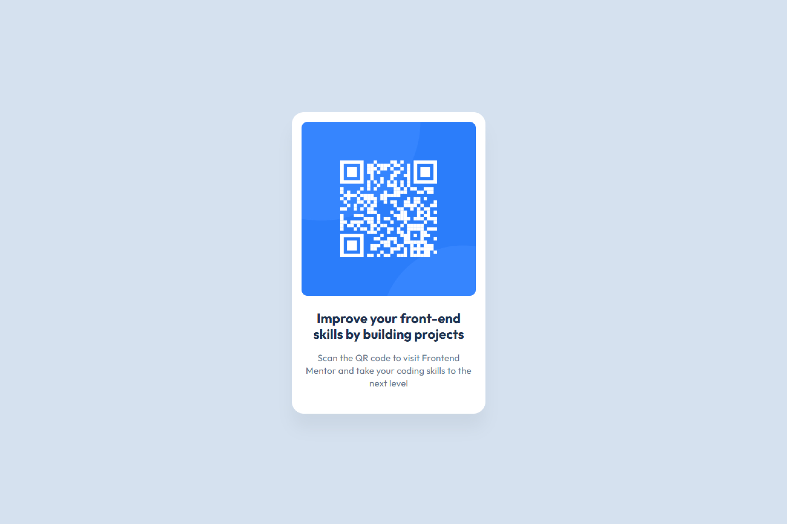

# Frontend Mentor - QR code component solution

This is a solution to the [QR code component challenge on Frontend Mentor](https://www.frontendmentor.io/challenges/qr-code-component-iux_sIO_H). Frontend Mentor challenges help you improve your coding skills by building realistic projects. 

## Table of contents

- [Overview](#overview)
  - [Screenshot](#screenshot)
  - [Links](#links)
- [My process](#my-process)
  - [Built with](#built-with)
  - [What I learned](#what-i-learned)
  - [Continued development](#continued-development)
  - [Useful resources](#useful-resources)
  - [AI Collaboration](#ai-collaboration)
- [Author](#author)

## Overview

### Screenshot

### Links

- Solution URL: [Add solution URL here]([https://your-solution-url.com](https://github.com/kainemichael/qr-code-componentt))
- Live Site URL: [Add live site URL here]([https://your-live-site-url.com](https://qr-code-componentt-indol.vercel.app/))

## My process

### Built with

- Semantic HTML5 markup
- CSS custom properties
- Flexbox
- [Styled Components](https://styled-components.com/) - For styles

### What I learned

- Learnt how to import fonts from google fonts
- Building a mini design system
- CSS Variables

### Continued development

- Would love to learn more CSS varianbles and fucntions
- How to effectively use the right HTML tags
- Write DRY codes. 

### Useful resources

- [Creating a CSS Design System]([https://www.example.com](https://dev.to/crypto3p/creating-a-css-design-system-1dha)) - This helped me learn how to create a CSS Design System. I really liked how the person listed them out, it could serve as a guideline i open when i want to write more CSS desihn systems.

### AI Collaboration

No AI collaboration for this particluar project, all codes were written by me.

## Author

- Website - Michael Kaine
- Frontend Mentor - [@kainemichael](https://www.frontendmentor.io/profile/kainemichael)
